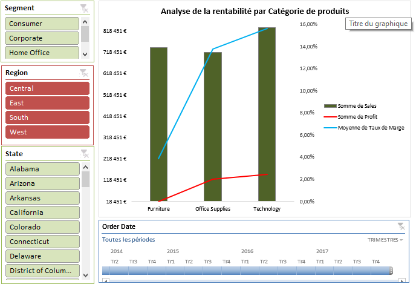

# Analyse des Ventes et de la Rentabilité - Superstore
## 📊 Présentation du Projet
Ce projet consiste en une analyse complète des données de vente d'une grande enseigne de distribution. L'objectif était d'identifier les zones de perte et de proposer des recommandations stratégiques.

## 🛠️ Outils Utilisés
* **Excel** (Tableaux Croisés Dynamiques, Segments, Graphiques Combinés)
* **Analyse de données** (Calcul de taux de marge, identification d'insights)

## 💡 Découvertes Clés
* **Problème de rentabilité :** La catégorie **Furniture** présente des marges négatives dans la région **Central**.
* **Performance :** La région **West** est la plus performante.
* **Insight :** Le volume de ventes ne garantit pas le profit (mise en évidence via un graphique combiné).

## 🖥️ Aperçu du Dashboard

